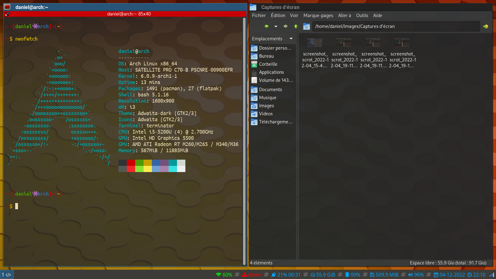
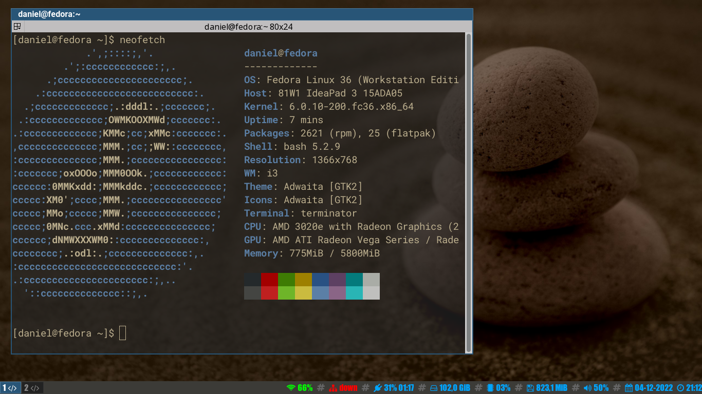
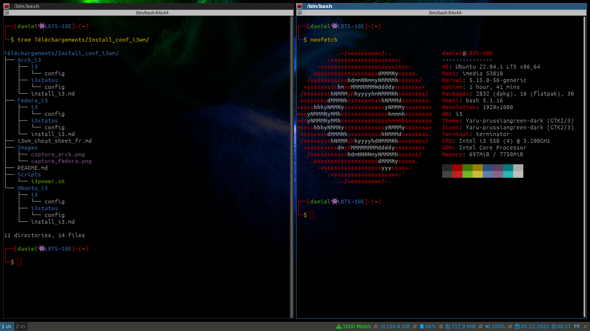

# Installation et configuration d'I3wm 

|Dossiers|Informations|
|---|---|
|`├── Arch_i3`|Procédure d'installation et fichiers de configuration pour Arch Linux.|
|`├── Fedora_i3` |Procédure d'installation et fichiers de configuration pour Fedora.|
|`├── Ubuntu_i3`|Procédure d'installation et fichiers de configuration pour Ubuntu.|
|`├── i3wm_cheat_sheet_fr.md`|Aide-mémoire concernant les raccourcis et les commandes sur I3wm.|

## Captures d'écran

### Arch Linux 2022

### Fedora 36

### Ubuntu 22.04

## Dossiers utilisés par la configuration

|Dossier|Description|
|---|---|
|/usr/shere/backgrounds|Les images du fond d'écran.|
|${HOME}/.config/i3|La configuration générale de i3.|
|${HOME}/.config/i3status|La configuration de la barre de statut.|
|${HOME}/.config/i3scripts|Emplacement des scripts personnels.|
|/tmp/screen_locked.png|Image utilisé comme fond d'écran de verrouillage.|
